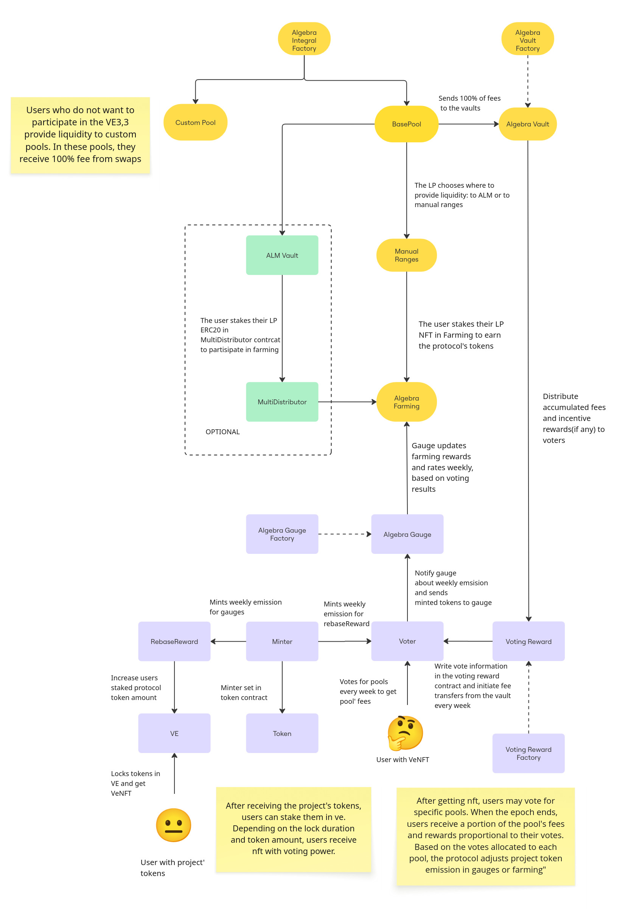

# Algebra VE(3,3)

### Overview

VE(3,3) was introduced by Solidly Protocol and since then has become an important staple of DEX space.&#x20;

Many successful protocols have utilized the VE(3,3) model to boost their launch and maintain sustainable tokenomics. Protocols like Aerodrome, Thena, Blackhole have all made advancements on the initial concept but the core principles remain unchanged.&#x20;

The Algebra team introduces VE(3,3) features built over the Algebra Integral. This implementation captures the latest advancements in VE tokenomics while also benefitting from unique Algebra Integral features like Eternal Farming.

### Classic Approach Recap

**Rewards Emission**

VE(3,3) changes the incentives for the liquidity providers. On classic DEXes LPs receive parts of the swap fees.&#x20;

With VE(3,3) approach LPs instead obtain the reward token issued by the protocol. The reward token has its own price (usually it is a native protocol token) and can also be used in vote escrow (VE).&#x20;

Reward tokens emission is a continuous process that keeps going indefinitely. It is a driver of VE(3,3) tokenomics. However, to avoid unbounded inflation of the reward token the emission rate is usually set to decline over time.

**Vote Escrow**

Vote escrow is the part that lets LPs claim swap fees collected by DEX while also providing implicit governance that makes DEX more balanced.&#x20;

The reward tokens are locked for a predefined period of time in exchange for ‘voting token’ (veToken) with an assigned ‘voting power’. Voting power depends on the amount of reward tokens staked and the duration of the lock time period.&#x20;

Since the reward emission is ongoing, old veTokens would lose their voting power compared to the total voting power assigned. To avoid that the Reward Rebase mechanics is introduced: part of the emission goes to existing veTokens so that their voting power stays the same (or grows if we want to further incentivize participation in vote escrow).

**Voting**

Classic VE(3,3) operates with time periods called epochs (usually 1 week). At the end of the epoch all accumulated fees are distributed and the voting for the next epoch happens.&#x20;

Every holder of veToken may cast their vote at the pools of their choice, splitting their allocated vote power.&#x20;

**Voting Outcome**

When the voting ends, 2 factors are being set for the next epoch:

First, the proportion of votes in a single pool will define how the accumulated fees in the upcoming epoch will be distributed. Example: LP has 250 voting power and votes for a specific pool. If somebody else casts 500 votes for that pool, first LPs will receive ⅓ and second will receive ⅔ of accumulated fees at the end of the epoch.

Note the interesting feedback here: most popular (most yield bearing) pools will have the most votes but that also makes the fee share of each voter less in absolute numbers. However, less interesting pools may provide some good opportunities for attentive voters: it might be lucrative to become a single voter for a pool that has an unexpected peak in the performance.

Second, the emission of rewards in the upcoming epoch is distributed across all pools matching the distribution of the collected votes. So pools without votes get zero rewards from emission.

### **Algebra VE(3,3)**&#x20;

Algebra implementation of VE(3,3) mostly follows the classic approach with some changes brought by the Algebra Integral features.&#x20;

**Emission**

Emission is split in 3 parts: Gauge (LPs), Rebase, Treasury. The ratio of allocation is configurable. For example, the settings may look like this:

`Start emission: 2% of supply`

`Gauge: reduction with 0.99 coefficient every epoch, min 0.2% of supply`

`Rebase: 10%-40% of emission`

`Treasury: up to 5% of emission`

The emission distribution to LPs is controlled by the Eternal Farming feature. Emission is allocated to the positions that are actively participating in swaps, discouraging ‘idle farming’.

**VE(3,3) Pool Setup**

When the pool is configured to participate in VE(3,3), all LPs in that pool should also participate in order to receive any rewards. This restriction exists because pool’s fees are fully captured as a community fee and individual positions are not eligible for the fee claims.

**ALM Participation**

If an ALM solution is compatible with the Algebra ALM Vault, its positions may participate in the rewards distribution process. ALM Vault will accumulate the rewards allocated by Eternal Farming and LPs may claim them according to their share in the Vault’s liquidity.

**Reward Distribution**

Reward distribution is triggered at the start of an epoch by the call to VotingReward contact. This call can be done manually or be automated via simple backend/script/Chainlink.

### **Architecture**

<figure><figcaption></figcaption></figure>
