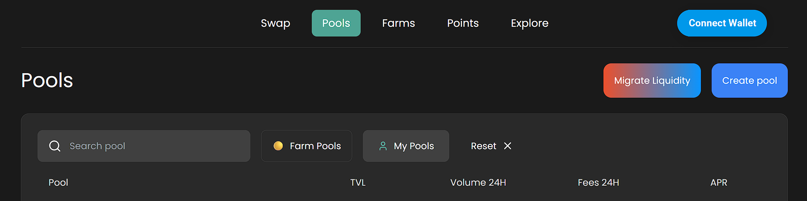
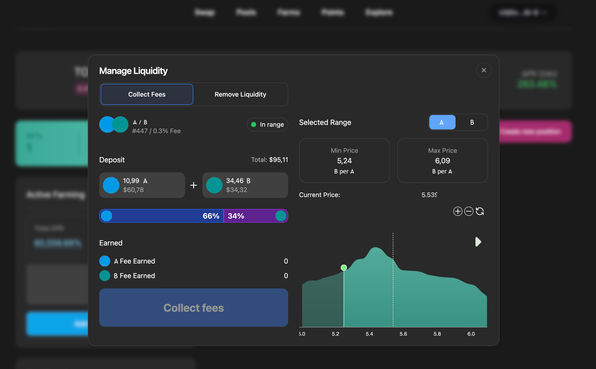

# Managing & Adjusting Positions


**Note for DEX Teams:**

This section provides a **practical guide to maintaining and optimizing active positions**. It helps users maximize profitability and manage risks—an important UX lever for long-term engagement and user retention.

The illustrated mechanics use **Algebra’s testnet visuals** and are intended as templates for your branded DEX UI.


## Where to Find Your Positions

Navigate to the **"My Pools"** tab on the **Pools** page to view all your active and inactive liquidity positions.

<figure><figcaption></figcaption></figure>

### Position Management Options

Click on any position to open the **position management panel**, where you’ll see:

* Total Value
* Assets Deposited
* Current Price Range
* Pending Fees / Rewards
* Current Status (Active / Inactive)

From this panel, you can perform the following actions:

**1. Collect Fees**

* Click **"Collect"** to claim all accumulated fees and rewards.
* Confirm the transaction in your wallet.

**2. Withdraw Liquidity**

* Choose **"Remove Liquidity"** to remove all or part of your liquidity.
* You can fully exit the pool or reduce exposure.
* Confirm in your wallet and receive your tokens back.


_Note:_ You cannot adjust the **price range** of an existing position. If you want to change this parameter, you must first withdraw your position and then create a new one with updated settings.


<figure><figcaption></figcaption></figure>

#### Want to learn more about liquidity management strategies?

Check out the following pages to explore different approaches based on your goals and market behavior:


[basic-price-range-presets.md](../price-ranges-and-liquidity-strategies/basic-price-range-presets.md)



[advanced-range-presets.md](../price-ranges-and-liquidity-strategies/advanced-range-presets.md)



[matching-your-liquidity-strategy-to-market-moves.md](../price-ranges-and-liquidity-strategies/matching-your-liquidity-strategy-to-market-moves.md)



[swap-and-lp-strategies-with-price-ranges.md](../price-ranges-and-liquidity-strategies/swap-and-lp-strategies-with-price-ranges.md)



[liquidity-scenarios-and-risk-profiles.md](../price-ranges-and-liquidity-strategies/liquidity-scenarios-and-risk-profiles.md)

