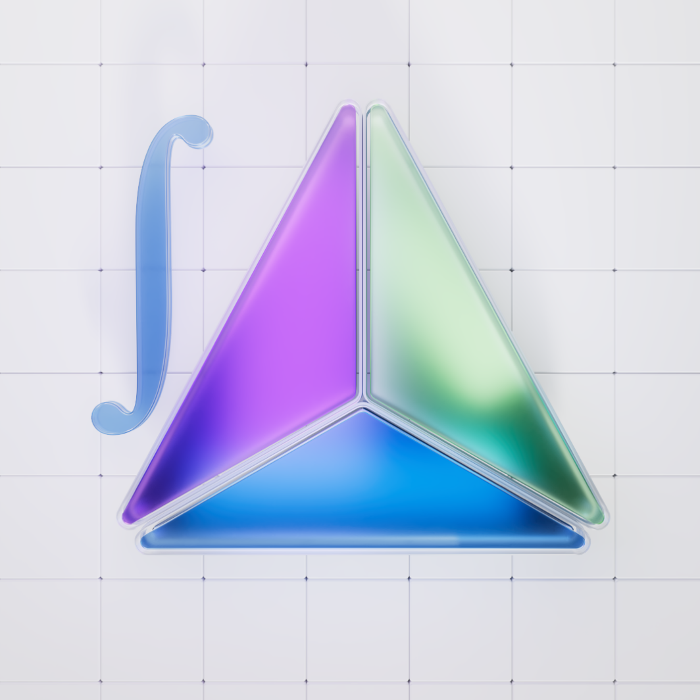

# 👨‍🎨 Brand Assets

## Taglines

Concentrated Liquidity AMM Protocol with Dynamic Fees, Onchain Farming, v4 plugins support and much more, utilized by 30+ DEXes.

Algebra: The Leading Trading & Liquidity Infrastructure for decentralized exchanges.

Algebra is a DEX engine with a unique AMM model, offering features like Concentrated Liquidity, Dynamic Fees, v4 Hooks support, and more—designed to supercharge DEX performance and capital efficiency!

## Classic Logos

<figure><figcaption></figcaption></figure> <figure><figcaption></figcaption></figure>

<figure><figcaption></figcaption></figure>

## Integral Logos

<figure><figcaption></figcaption></figure>

<figure><figcaption></figcaption></figure> <figure><figcaption></figcaption></figure>

<figure><figcaption></figcaption></figure>
