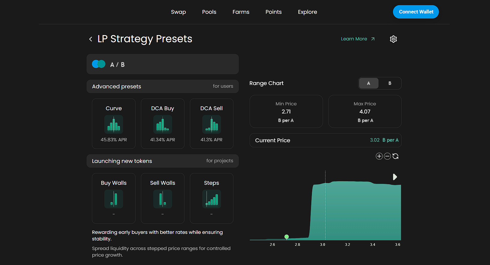
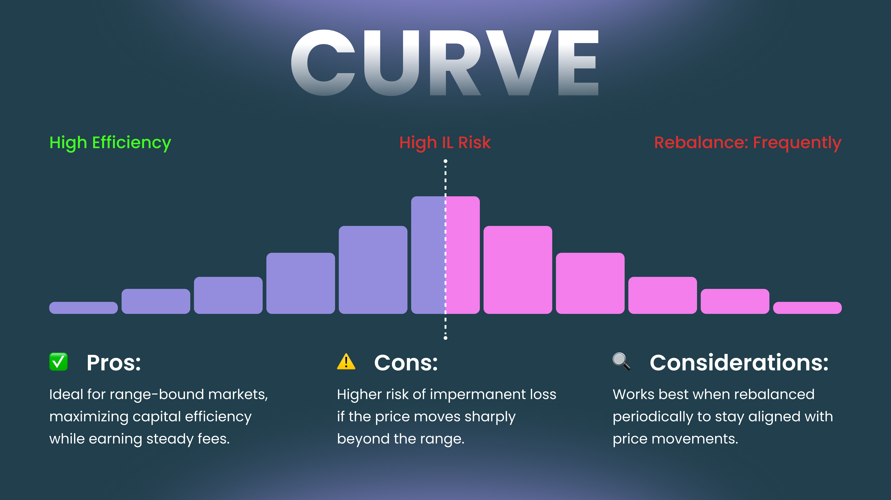
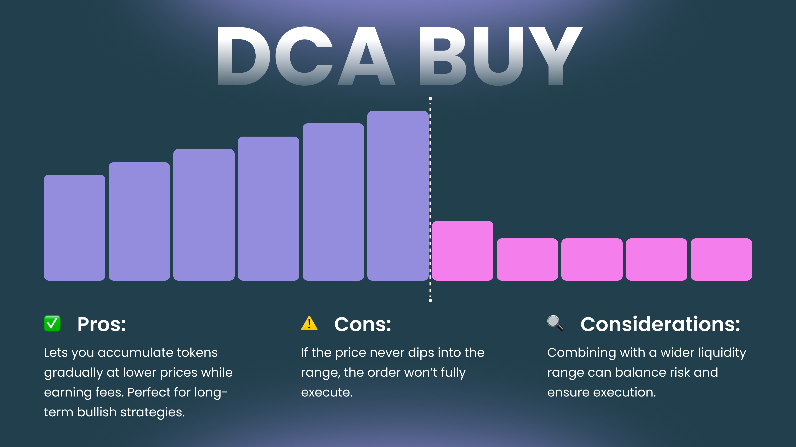
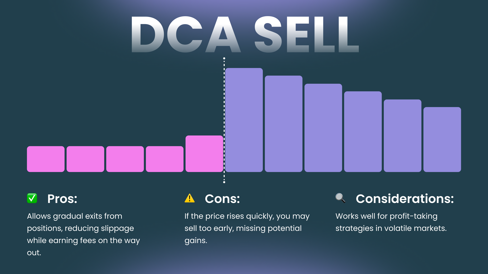
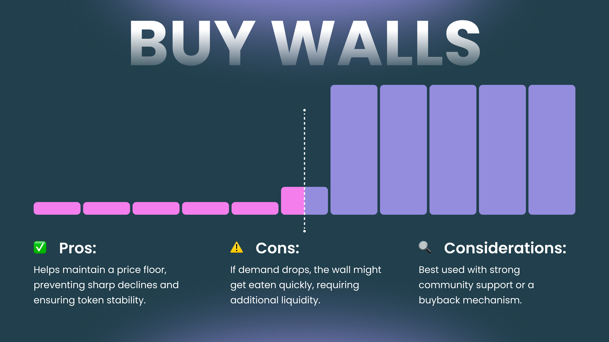
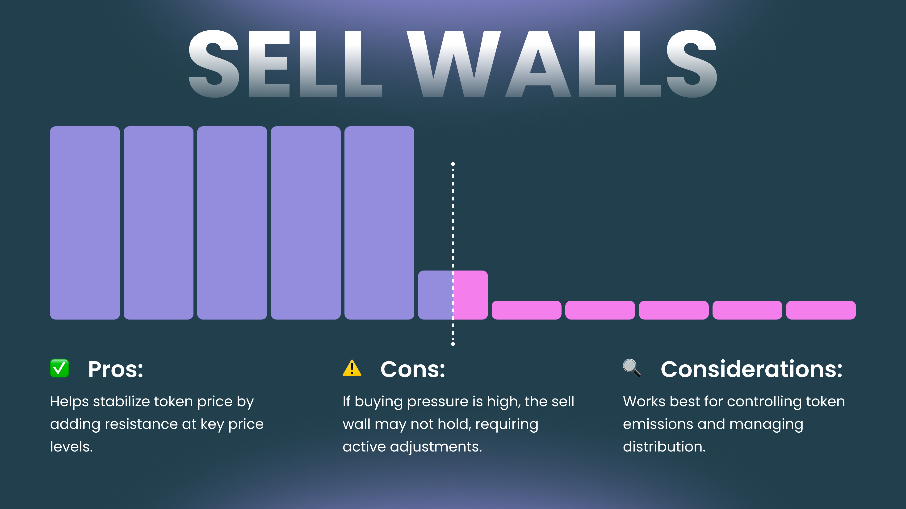
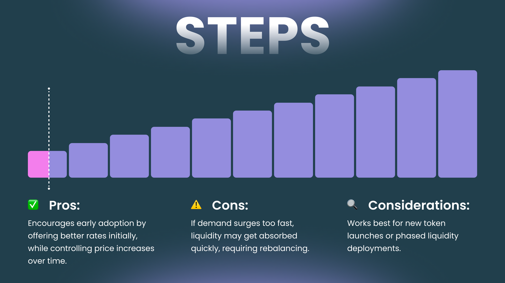

# Advanced Range Presets


**Note for DEX Teams:**

This section presents a sample of **advanced range presets** that can be offered to liquidity providers. These are starting points only — final strategies should be **customized by the DEX team** according to:

* The behavior of target user segments
* The volatility and nature of the paired assets
* The overall goals of the protocol (e.g. depth, stability, efficiency)

The current examples use **Algebra’s generic onboarding materials**, which are **to be tailored** to your DEX chosen mechanics and product positioning.


### Advanced Liquidity Strategy Presets

**Concentrated liquidity** gives Liquidity Providers (LPs) the flexibility to go beyond the classic 50/50 token distribution and apply strategic positioning to maximize earnings. The **“Advanced LP Strategy Presets”** tab includes ready-made strategies that help optimize how your liquidity is deployed.

<figure><figcaption></figcaption></figure>

> ⚠️ These presets are designed for users with experience in managing concentrated liquidity positions.\
> If you’re new to liquidity provision, we recommend reviewing:
>
> * [**Basic Price Range Presets**](/broken/pages/MuaNRRIv2WXIIfNAfDCz)
> * [**Swap & LP Strategies with Price Ranges**](/broken/pages/3ssZKTRuZ6ixJYPdUgJP)

Advanced strategies may require more frequent position monitoring and active management. Make sure you understand the risks before deploying—fund management is your sole responsibility.

#### Choosing the Right Strategy

Each strategy preset supports different goals—whether you’re an LP aiming to boost returns or a project managing liquidity for a token launch. There’s no universal “best” option. Strategy performance depends on market conditions and how actively you manage your position.

Presets are grouped into two categories:

* **For LPs** – Optimized strategies for fee generation and market responsiveness
* **For Projects** – Liquidity structuring tools for launches and price management

Presets may be limited to select trading pairs depending on your DEX configuration.

<figure><figcaption></figcaption></figure>

## Advanced Presets for LPs

### **Curve – Balanced Exposure**

<figure><figcaption></figcaption></figure>

Ideal for stable assets or key price zones in volatile markets.

* Designed for steady fee income from moderate price movement
* Combines wide and narrow liquidity bands

💡 _Example Setup:_

* Position 1 (Wide Range): \[-15%, +15%] – 60% of liquidity
* Position 2 (Narrow Range): \[-5%, +5%] – 40% of liquidity\
  📌 **Total Range:** \[-15%, +15%]

### **DCA Buy / DCA Sell – Gradual Accumulation or Exit**

Great for building or reducing positions over time, while still earning swap fees.

### **DCA Buy**

<figure><figcaption></figcaption></figure>

* Works like a limit order, but also collects fees
* Reduces slippage for large token buys

💡 _Setup:_

* Position 1: \[-10%, +2%] – 80% of liquidity
* Position 2: \[-2%, +10%] – 20% of liquidity\
  📌 **Total Range:** \[-10%, +10%]

### **DCA Sell**

<figure><figcaption></figcaption></figure>

* Ideal for structured token exit strategies

💡 _Setup:_

* Position 1: \[-10%, +2%] – 20% of liquidity
* Position 2: \[-2%, +10%] – 80% of liquidity\
  📌 **Total Range:** \[-10%, +10%]

## Advanced Presets for Projects

### **Buy/Sell Walls – Price Support & Resistance**

Helps shape early market dynamics by stabilizing token price and adding depth.

### **Buy Wall**

<figure><figcaption></figcaption></figure>

* Prevents sudden price drops
* Can support automatic buybacks

💡 _Setup:_

* Position 1: \[-10%, 0%] – 20% of liquidity
* Position 2: \[0%, +5%] – 80% of liquidity\
  📌 **Total Range:** \[-10%, +5%]

### **Sell Wall**

<figure><figcaption></figcaption></figure>

* Prevents sudden spikes by distributing sell-side liquidity

💡 _Setup:_

* Position 1: \[-5%, 0%] – 80% of liquidity
* Position 2: \[0%, +10%] – 20% of liquidity\
  📌 **Total Range:** \[-5%, +10%]

### **Steps – Structured Price Growth**

<figure><figcaption></figcaption></figure>

Used for controlled token price progression and structured early-stage trading.

* Encourages adoption by offering better initial prices
* Gradually raises prices as demand increases

💡 _Setup:_

* Position 1: \[-10%, +5%] – 5% of liquidity
* Position 2: \[+5%, +15%] – 10%
* Position 3: \[+15%, +25%] – 25%
* Position 4: \[+25%, +35%] – 60%\
  📌 **Total Range:** \[-10%, +35%]

## Risk Reminder

Providing liquidity involves certain risks:

⚠️ **Impermanent Loss** – You might lose value compared to simply holding the assets.\
⚠️ **Market Volatility** – Price swings can move liquidity out of range, stopping fee accrual.

Advanced strategies can boost potential returns but also come with added complexity.\
**Always do your own research before deploying funds.**
