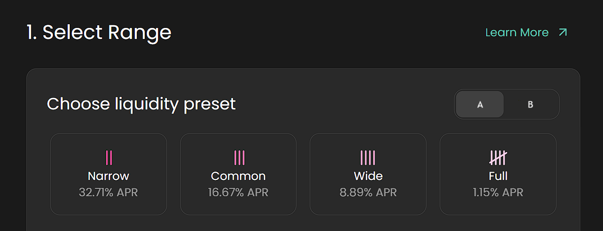

# Basic Price Range Presets


**Note for DEX Teams:**

This section introduces **price range presets** use in concentrated liquidity provisioning.

Use this section to help your users understand:

* How to set custom price ranges
* The difference between full-range vs. narrow-range provisioning

The examples below use **Algebra’s standard testnet UI and onboarding materials**, designed to illustrate key mechanics. These materials are **to be recreated and adapted** to match the final UI and UX of your DEX product.


When providing liquidity, users allocate their assets to a specific **price range** — defined by the upper and lower bounds where their liquidity will remain active.\
This approach is central to concentrated liquidity AMMs and enables capital efficiency.

## Available Presets

To simplify this experience, DEXs built on Algebra can offer **preset ranges** designed for different user needs and risk appetites.\
These include: **Narrow**, **Common**, **Wide**, and **Full Range** options.

*   **Narrow Range**\
    Example: –5% to +10% of current price

    > Designed for advanced LPs aiming to maximize fee generation through high concentration. Requires active management.
*   **Common Range**\
    Example: –10% to +20%

    > Balanced option for moderate fee income and risk. Suitable for users with some DeFi experience.
*   **Wide Range**\
    Example: –20% to +40%

    > Offers reduced exposure to impermanent loss and less frequent rebalancing. Good for more volatile pairs or passive LPs.
*   **Full Range**\
    Covers the entire price spectrum

    > Emulates V2-style passive LPing. Simplest for new users but less capital-efficient.

<figure><figcaption></figcaption></figure>

## Narrow vs Wide Ranges

<figure><figcaption></figcaption></figure>

#### **Narrow Ranges** 

* **High Fee Generation**: Generate more fees due to concentrated liquidity.
* **Constant Monitoring**: Require frequent rebalancing to stay within the active range.
* **High Impermanent Loss**: Heavily exposed to rapid price movements and IL.

#### Wide Ranges 

* **Lower Fee Generation**: Generate fewer fees as liquidity is spread out.
* **Less Frequent Rebalancing**: Require less manual intervention.
* **Reduced Impermanent Loss**: Less affected by price movements.

## Choosing the Right Range

#### For Volatile Pairs

Pairs like ETH / USDT or ARB / USDT generally experience frequent price fluctuations.\
In these cases:

* **Wide ranges** are often ideal for low to mid-volume pairs, reducing rebalancing needs and impermanent loss.
* **Narrow ranges** may be profitable only on high-volume pairs, where trading fees are sufficient to outweigh risks and maintenance.

> 💡 _Tip for users_: Rebalancing a narrow position frequently incurs gas fees, slippage, and opportunity costs. Consider passive ranges unless confident in active management.

#### For Pegged Pairs

Pegged or stable pairs (e.g., USDT / USDC, stETH / ETH) are generally low-risk in terms of impermanent loss.

* **Very narrow ranges** (e.g., ±0.1%) are viable due to tight price correlation.
* In the event of a minor depeg, LPs can:
  * Close the position
  * Swap to rebalance
  * Reopen at the new price center

This strategy is only profitable if collected fees exceed the cost of repositioning. In low-volume environments, a **slightly wider preset** might be more practical to reduce management friction.

