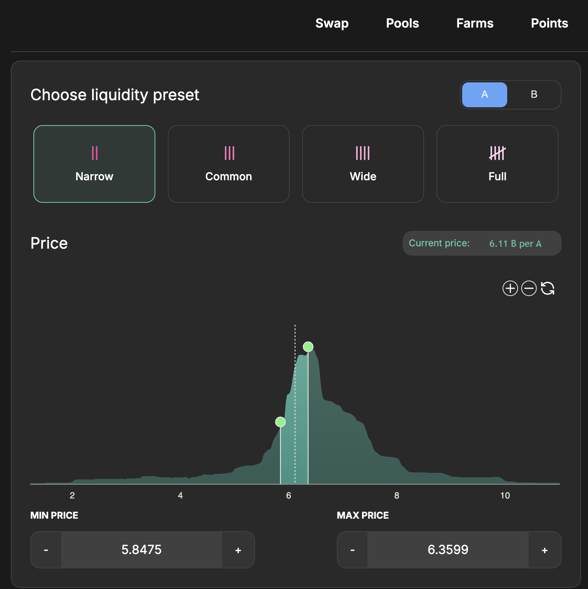
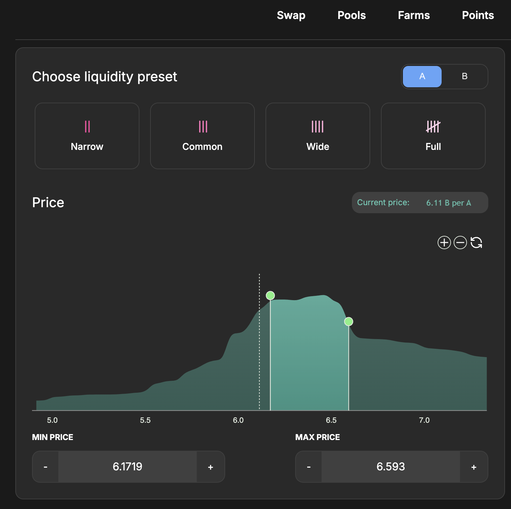
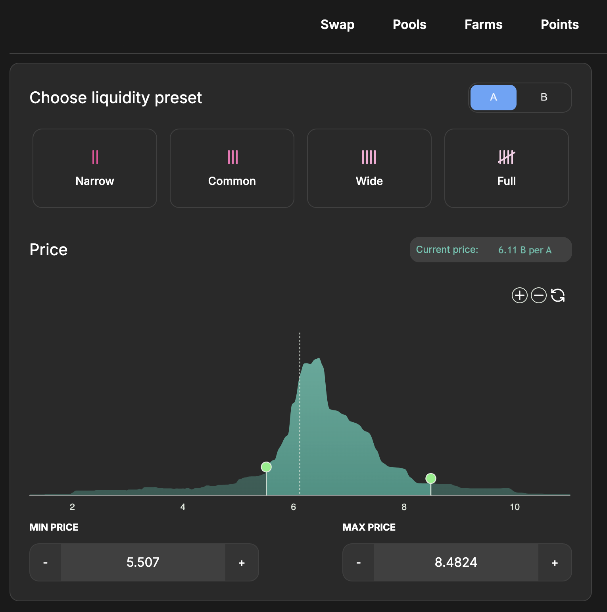

# Swap & LP Strategies with Price Ranges


**Note for DEX Teams:**

**Advanced swap mechanics that turn users into liquidity strategists.** This section explores how traders can use range-based strategies like Range Orders, Dollar Cost Averaging, and Covered Calls—not only to trade, but to earn.

Illustrations are from **general Algebra onboarding materials** and should be adapted to the specific DEX UI for final deployment.


Algebra-powered DEXs introduce **concentrated liquidity**, enabling liquidity providers to optimize capital efficiency and actively manage positions. Whether you aim to earn more from fees, accumulate assets, or automate your exit strategy, here are **four foundational strategies** to get you started.

## 1. APR-Focused Strategy

This strategy aims to **maximize fee generation** by maintaining a tight liquidity range around the current price. Since concentrated liquidity is only active when the price is within range, narrower bands mean higher capital efficiency and more fee income.

<figure><figcaption></figcaption></figure>

**How to apply it:**

* Select **high-volume trading pairs** with stable performance.
* Use **narrow price bands** and monitor trading volume, TVL, and fee APR charts.
* Regularly **rebalance** to keep your position within the active trading zone.

Best for: Active LPs focused on **yield optimization** rather than asset appreciation.

## 2. Range Order Strategy (Buy/Sell)

A **Range Order** is similar to a limit order—but instead of paying a fee to execute a trade, you **earn fees** while waiting.

<figure><figcaption></figcaption></figure>

* **Sell Strategy:**\
  Provide **single-sided liquidity** in the volatile asset (e.g., a token like XYZ) above the current price. If price rises into the range, your tokens convert to the stable asset (e.g., USDC) while earning fees.
* **Buy Strategy:**\
  Deposit stablecoins below the current price. If the price drops into the range, the stablecoins convert into the volatile token as it becomes cheaper.

Think of it as a **limit order that pays you** instead of charging you.

## 3. Dollar Cost Averaging (DCA)

DCA with liquidity ranges allows you to **accumulate or distribute** tokens gradually, regardless of market direction. The wider the range, the more gradual your entry/exit—and the more time your liquidity stays active.

* **Sell DCA:**\
  Provide volatile assets within a broad upward price range. As price rises, your position gradually converts to stablecoins, distributing the token over time.
* **Buy DCA:**\
  Provide stablecoins across a lower range. As price declines, your stablecoins accumulate the token gradually.

Best for: Users who prefer a **longer-term, passive strategy** while still earning swap fees.

<figure><figcaption></figcaption></figure>

## 4. Covered Call (Sell Focus)

This strategy mimics the mechanics of a **covered call option**, enabling you to earn premiums while setting a predefined exit price.

* Provide **single-tick liquidity** (very narrow range) in the volatile token just above the current market price.
* When the price enters your range, your asset converts to stablecoins and you capture fees—just like collecting an option premium.

> To secure profits and avoid reversal, **withdraw your liquidity** once the price target is reached.

Ideal for: Traders with a defined **exit target** and a desire to earn passive fees along the way.

## Summary

| Strategy     | Market Bias      | Fee Focused     | Asset Accumulation     | Active Mgmt           |
| ------------ | ---------------- | --------------- | ---------------------- | --------------------- |
| **Strategy** | **Market Bias**  | **Fee Focused** | **Asset Accumulation** | **Active Management** |
| APR-Focused  | Sideways         | ✅ Yes           | ❌ No                   | ❗️ High               |
| Range Order  | Directional      | ✅ Yes           | ✅ Yes                  | ⚠️ Medium             |
| DCA          | Neutral/Flexible | ✅ Yes           | ✅ Yes                  | ✅ Low                 |
| Covered Call | Bullish Exit     | ✅ Yes           | ❌ No                   | ⚠️ Medium             |
