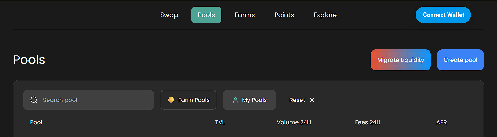
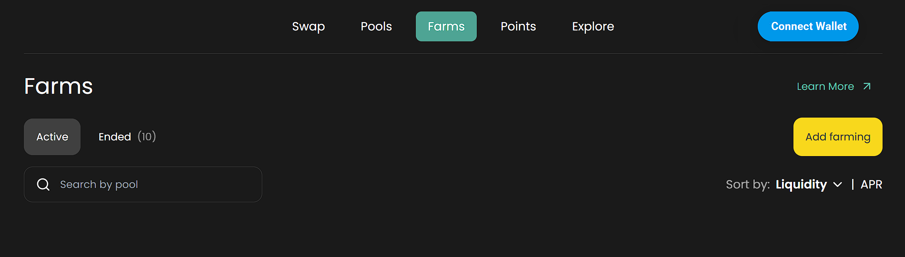

# Farming


**Note for DEX Teams:**

Farming functionality on Algebra-powered DEXes is highly customizable. While this guide outlines the **default mechanics**, DEX teams can **adjust farming formulas, reward distribution logic, token multipliers, and update intervals** based on their unique economic models or ecosystem goals.


## How to Start Farming

Liquidity provider (LP) positions minted in a pool **automatically participate in farming** if farming is enabled for that pool. To easily find eligible pools, use the **“Active Farming” toggle** on the Pools page or navigate directly to the **Farms tab**.

<figure><figcaption></figcaption></figure>

<figure><figcaption></figcaption></figure>

## How to Claim Fees

**Farming rewards can be claimed** from either the Pools or Farms pages. Eligible positions will be visible on both. To collect your rewards:

1. Click **Approve** to authorize the reward contract (one-time action per position),
2. Then click **Claim** to receive the rewards.

## How Farming Works

Farming on Algebra-powered DEXes serves as a **reward boost on top of swap fees**, incentivizing liquidity provision. However:

* **Farming rewards are only distributed to in-range liquidity** (i.e., positions that are currently active in the market price range),
* **No rewards are earned during inactive periods**, or when there is **no trading volume** in the pool.

## Rewards Calculation

$$
rewardToken = farming.rewardRate * INTERVAL  * rewardToken.derivedToken
$$

$$
farmingMultiplier=rewardsTOKEN / FeeCollectedTotalTOKEN
$$

**Key Terms:**

* `farming.rewardRate`: Amount of reward token distributed per interval
* `INTERVAL`: Duration of the interval
* `rewardToken.derivedToken`: Value of the reward token expressed in the DEX’s main token (e.g., ETH, TON)
* `feeCollectedTotalTOKEN`: Total fees collected across the pool during the interval (in the platform's token)

**Example:**

• farming.rewardRate: $500/day in USDT

• INTERVAL: 1 day

• rewardToken.derivedTOKEN: 1 TOKEN = 6 USDT

• TVL of the pool: $1,000,000

• Pool Trading Volume: $500,000/day

• Pool Commission Percentage: 0.3%

• Fee Collected: $1,500

In this case, the farming multiplier is 1.33, meaning liquidity providers will receive additional 0.33 TOKEN for each TOKEN of fees collected, provided liquidity is within the active price range.
